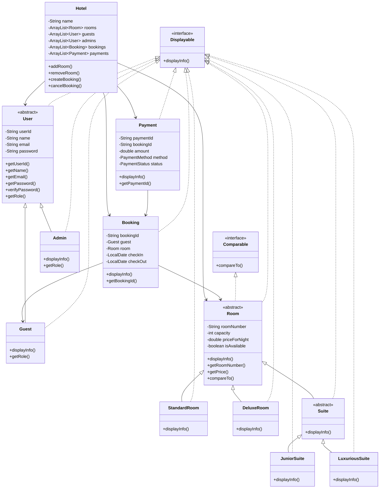

# 🏨 Hotel Booking System

A comprehensive Java-based hotel management system that allows guests to book rooms, manage reservations, and handle payments efficiently.

## ✨ Features

### 👥 User Management
- Guest registration and authentication
- Admin panel for system management
- Secure password handling
- User profile management

### 🛏️ Room Management
- Multiple room types (Standard, Deluxe, Suite)
- Room availability tracking
- Detailed room information display
- Room features and amenities tracking

### 📅 Booking System
- Real-time room availability checking
- Flexible check-in/check-out dates
- Booking status tracking (Booked, Checked-in, Checked-out, Cancelled)
- Booking history for guests

### 💳 Payment Processing
- Multiple payment methods (Cash, Credit Card, Debit Card, PayPal)
- Payment status tracking
- Promo code support
- Refund handling

### 🎯 Additional Features
- Beautiful GUI using JavaFX
- Responsive design
- Real-time availability updates
- Comprehensive error handling

## 🛠️ Technical Details

### Built With
- Java 8+
- JavaFX for GUI
- Object-Oriented Programming principles
- Design Patterns implementation

### Project Structure
```
src/main/java/org/advcomprog/hotelbooking/hotelbookingsystem/
├── User.java (Abstract)
├── Guest.java
├── Admin.java
├── Room.java (Abstract)
├── StandardRoom.java
├── DeluxeRoom.java
├── Suite.java (Abstract)
├── JuniorSuite.java
├── LuxuriousSuite.java
├── Booking.java
├── Payment.java
├── Hotel.java
└── HotelBookingSystem.java
```
## 📋 UML Diagram

## 🙏 Acknowledgments
- Thanks to all contributors
- Inspired by real-world hotel management systems
